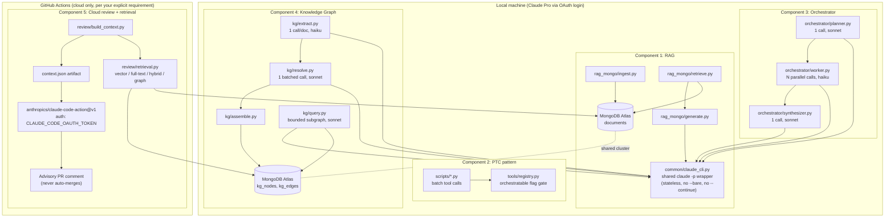

# Project schema: RAG + PTC + Orchestrator + Knowledge Graph + Cloud Review

Generated for the combined setup script. All 5 components run on a
Claude Pro/Max subscription -- no Anthropic API key anywhere in this repo.

## Architecture diagram



## Directory tree

```
.
|-- common/
|   `-- claude_cli.py          # single shared `claude -p` subprocess wrapper
|-- rag_mongo/                 # Component 1: RAG over MongoDB Atlas
|   |-- config.py db.py embeddings.py ingest.py retrieve.py generate.py pipeline.py
|-- rag_cli.py                 # entrypoint: init | ingest | query
|-- tools/                     # Component 2: PTC pattern
|   |-- registry.py            # orchestratable=True/False gate
|   `-- example_tools.py       # reference tool implementations
|-- scripts/
|   `-- orchestration_template.py
|-- .claude/skills/programmatic-tool-calling/SKILL.md
|-- orchestrator/               # Component 3: plan-big / execute-small
|   |-- config.py planner.py worker.py synthesizer.py run.py
|-- orchestrator_cli.py
|-- kg/                         # Component 4: Knowledge Graph
|   |-- config.py schema.py db.py extract.py resolve.py assemble.py ingest.py query.py
|-- kg_cli.py
|-- review/                     # Component 5: cloud-only review + retrieval
|   |-- config.py retrieval.py build_context.py
|-- .github/workflows/
|   `-- claude-review.yml       # runs ONLY on GitHub's runners
|-- docs/
|   |-- PTC_PATTERN.md ORCHESTRATOR.md KNOWLEDGE_GRAPH.md CLOUD_REVIEW.md SCHEMA.md
|-- CLAUDE.md                   # project directives, auto-loaded by Claude Code
|-- requirements.txt .env.example .gitignore
```

## Component responsibility table

| # | Component | Entry point | Storage | Model tier | Runs where |
|---|---|---|---|---|---|
| 1 | RAG | `rag_cli.py` | `documents` (Atlas) | sonnet (configurable) | Local |
| 2 | PTC pattern | `scripts/*.py` | none (in-memory per run) | none (pure orchestration) | Local |
| 3 | Orchestrator | `orchestrator_cli.py` | none (stateless calls) | sonnet (plan/synth) + haiku (workers) | Local |
| 4 | Knowledge Graph | `kg_cli.py` | `kg_nodes`, `kg_edges` (same Atlas cluster) | haiku (extract) + sonnet (resolve/query) | Local |
| 5 | Cloud review | `.github/workflows/claude-review.yml` | reads `documents`, `kg_nodes`, `kg_edges` | sonnet (via claude-code-action) | **GitHub Actions only** |
| 6 | Command policy | `common/shell_exec.py`, `.claude/hooks/pre_tool_use.py` | `config/command_policy.json` (static) | none (deterministic) | Local + cloud |
| 7 | Math registry | `src/mathcore/registry.py` | `config/math_registry.json` (static) | none (deterministic) | Local + cloud |

## Component 6: command policy (schema 1.1.0)

Two enforcement points over one shared classifier, so they cannot disagree.

**Runtime** — `common/shell_exec.run()` validates a declaration against
`COMMAND_EXEC_SCHEMA` and refuses to execute when:

- the declared `classification` is weaker than `classify()` detects;
- `classification="destructive"` without `confirm_destructive=True`;
- `cwd` does not exist.

It then applies, in order: stream capture with `timeout_s`, `filter_mode`,
`max_lines`, `max_bytes`, and secret redaction. Destructive declarations are
forced to a single attempt regardless of `retry_policy`.

**Session** — `.claude/hooks/pre_tool_use.py` is a `PreToolUse` hook matched to
`Bash`. It refuses unbounded reads, output bounds above 5 lines, destructive
commands and credential-echoing commands. It ignores heredoc bodies destined
for a file (content is not a command line) but still inspects bodies fed to an
interpreter. It fails **open** on its own misconfiguration, and
`TB_COMMAND_POLICY=block|warn|off` overrides the configured level for one
session.

| Concern | Field | Default |
|---|---|---|
| Line cap | `output_policy.max_lines` | 50 (project directive: 5 per fetch) |
| Byte cap | `output_policy.max_bytes` | 65536 |
| Secret masking | `output_policy.redact.enabled` | `true` |
| Timeout | `timeout_s` | 120 |
| Effect class | `classification` | `read_only` (verified against the command) |
| Environment | `env.allowlist` | inherit everything unless set |

## Component 7: mathematical foundations registry

`config/math_registry.json` records every mathematical object this project
relies on or explicitly refuses, with a verdict on each. Loaded through
`src/mathcore/registry.py`, which validates structure against
`config/math_registry.schema.json` and then checks the things a JSON Schema
cannot express: unique ids, resolvable and acyclic `depends_on`, one owner per
implemented entry, **owner modules that exist on disk**, and that no `folklore`
entry is marked `implemented`.

`docs/MATH_FOUNDATIONS.md` is generated by `scripts/generate_math_docs.py`;
CI runs it with `--check` so the prose cannot drift from the data.
Architecture and build order live in `docs/MATH_ARCHITECTURE.md` and
`docs/MATH_ROADMAP.md`.

## Auth model (no API key anywhere)

| Context | Mechanism | Where configured |
|---|---|---|
| Components 1, 3, 4 (local) | OAuth login, Pro/Max subscription | `claude /login`, once |
| Component 5 (GitHub Actions) | OAuth token, Pro/Max subscription | `claude setup-token` (once, locally) -> `CLAUDE_CODE_OAUTH_TOKEN` repo secret |
| MongoDB Atlas (all components) | Connection string | `.env` (local) / `MONGODB_URI` repo secret (Actions) |

`common/claude_cli.py` never passes `--bare` (that flag requires
`ANTHROPIC_API_KEY` and breaks OAuth) and never passes `--continue`/`--resume`
(that would grow context across calls). Every call is a fresh, stateless
process -- this is the single rule that keeps token/context usage bounded
across all four local components.

## Data flow: how the components compose

- **RAG vs Knowledge Graph**: same Atlas cluster, different collections.
  RAG answers "what does document X say"; KG answers "who/what is connected
  to what" by tracing edges. `review/retrieval.py` (Component 5) queries
  both to ground PR reviews.
- **Orchestrator vs PTC pattern**: independent. Orchestrator delegates
  *reasoning* subtasks to a cheap model; PTC pattern delegates *tool-calling
  loops* to a script. Orchestrator workers may internally use `Bash` and
  therefore could invoke a PTC-style script if the subtask calls for it.
- **Cloud review is the only component that cannot run locally** by design
  (per your explicit requirement) -- it exists solely as a GitHub Actions
  workflow triggered on `pull_request`.

## Environment variables (full list)

See `.env.example` in the repo root for the authoritative, commented list --
this table is a summary, not a duplicate source of truth.

| Variable | Component | Default |
|---|---|---|
| `MONGODB_URI` | 1, 4, 5 | (required, no default) |
| `MONGODB_DB` | 1, 4 | `rag_db` |
| `VECTOR_INDEX_NAME` | 1, 5 | `vector_index` |
| `FULLTEXT_INDEX_NAME` | 5 | `fulltext_index` |
| `RAG_GENERATION_MODEL` | 1 | `sonnet` |
| `COORDINATOR_MODEL` / `WORKER_MODEL` | 3 | `sonnet` / `haiku` |
| `KG_EXTRACT_MODEL` / `KG_RESOLVE_MODEL` / `KG_QUERY_MODEL` | 4 | `haiku` / `sonnet` / `sonnet` |
| `KG_MAX_SUBGRAPH_TRIPLES` | 4, 5 | `40` |
| `REVIEW_MAX_CONTEXT_ITEMS` | 5 | `15` |
